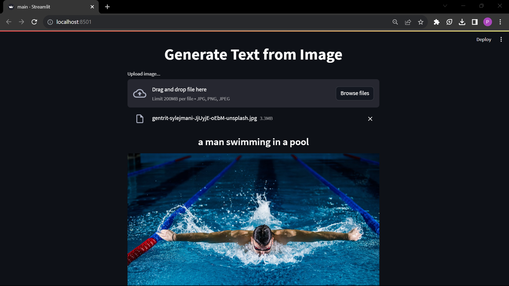
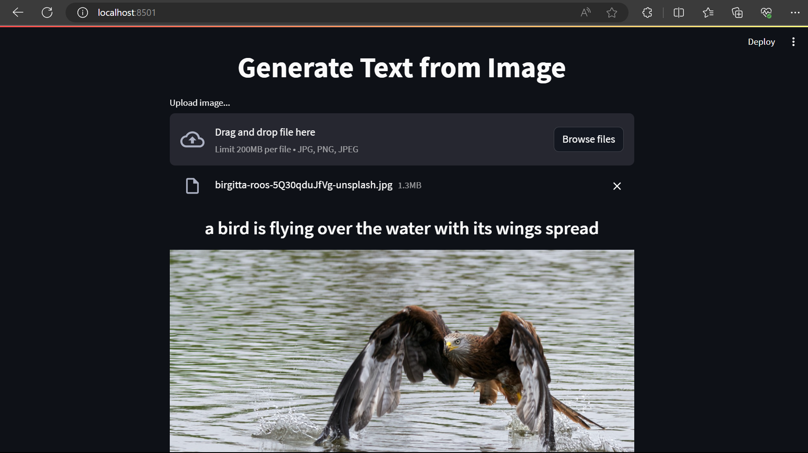

# ImageToTextGen
This code generates a text description from an image. The model used in this example is 'Salesforce/blip-image-captioning-base' (Bootstrapping Language-Image Pre-training) and you can find sample code in the Hugging Face repository. 
The required Python libraries can be found in the 'requirements.txt' file. All the code has been built and tested on a Windows OS machine. The code downloads the model on the first run into the 'models' folder. Afterward, this code can be used without an internet connection.

To learn more about BLIP https://blog.salesforceairesearch.com/blip-bootstrapping-language-image-pretraining/

## Setup
### Create python environment called imggen
```dos
    C:\Users\mailtopk\src\ImageToTextGen> python -m venv imggen
```

### Activate python environment
```dos
    C:\Users\mailtopk\src\ImageToTextGen>.\imggen\Scripts\activate.bat
```
If Powershell script, run activate.ps1

### Install required packages
```dos
    C:\Users\mailtopk\src\ImageToTextGen>pip install -r .\requirements.txt
```

### Run 
```dos
  C:\Users\mailtopk\src\ImageToTextGen>streamlit run .\main.py
``` 
For first run, code download the model, this may take some time

### Application

Image credit: **[Gabin Vallet]("https://unsplash.com/@gabinvallet?utm_source=unsplash&utm_medium=referral&utm_content=creditCopyText")** on **[Unsplash]("https://unsplash.com/photos/J154nEkpzlQ?utm_source=unsplash&utm_medium=referral&utm_content=creditCopyText")**
  



Image credit: **[Birgitta Roos]("https://unsplash.com/@birgittaroos?utm_source=unsplash&utm_medium=referral&utm_content=creditCopyText")**
on **[Unsplash]("https://unsplash.com/photos/5Q30qduJfVg?utm_source=unsplash&utm_medium=referral&utm_content=creditCopyText")**
  



